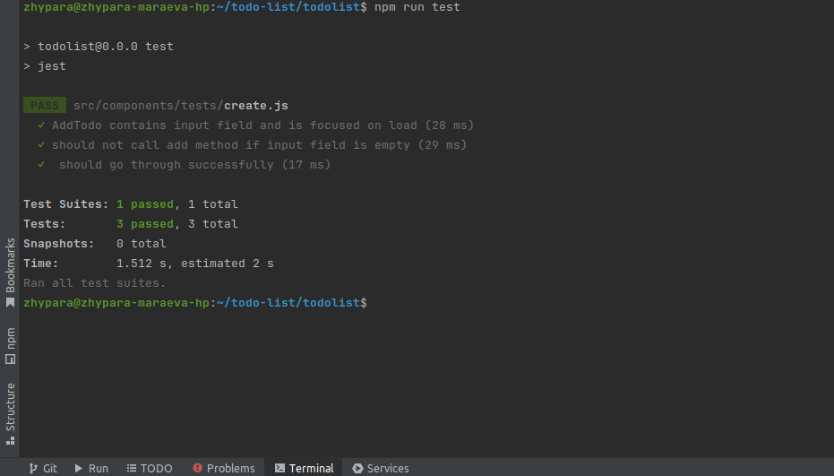

# React + Vite

Branch - master FrontEnd app, branch - server - Nodejs App

Frontend project for Todo list app using React18 and Vite, with Redux and Test implemented

Screen recording:

Simple Todo LIst App with CRUD actions

Test results:

